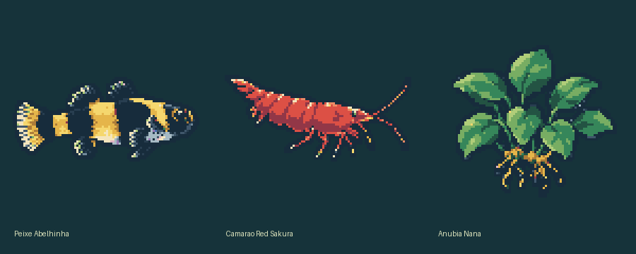

# Aquário

Aquário flutuante em pixel art: pipeline de imagem, RAG de compatibilidade e extensão Chrome MV3.

**Novo: transformar fotos com exatamente Qwen/Qwen-Image.** Use o [guia do runner img2img](docs/QWEN_PIXELART.md), o [notebook GPU](notebooks/Qwen_Pixel_Art.ipynb) ou o [pacote portátil](dist/aquario-qwen.zip). Esse caminho é separado do backend Qwen Edit anterior e utiliza os pesos pré-treinados, sem exigir fine-tuning para o primeiro teste.

**Entrega funcional local:** 3 sprites gerados a partir das fotos do catálogo; 651 fichas indexadas com embeddings multilíngues reais; API de compatibilidade; extensão pronta para carregar. **Ainda não executado:** fine-tuning / inferência Qwen / lote completo em CUDA e validação da extensão instalada no Chrome. O modelo ajustado não existe ainda. Os três pares entregues são o smoke test, não um dataset suficiente para treinar um modelo generalizável.



## Início rápido

Executar os comandos na raiz deste projeto. Neste Mac, `.venv` já está preparado. Para instalação nova, preferir Python 3.11 e ambiente virtual limpo:

```bash
python3 -m venv .venv
source .venv/bin/activate
python -m pip install -e '.[test]'
python scripts/smoke_sprites.py
python -m aquarium.cli index
python -m aquarium.cli export
python -m uvicorn aquarium.api:app --host 127.0.0.1 --port 8765
```

A primeira indexação baixa `sentence-transformers/paraphrase-multilingual-MiniLM-L12-v2`. Depois do download, funciona offline; os pesos ficam em `data/cache/huggingface`. TensorFlow e Flax são desativados no carregamento para evitar conflitos desnecessários. Não usar `--host 0.0.0.0`: esta API foi projetada para o dispositivo local.

No Chrome, abrir `chrome://extensions`, ativar **Modo do desenvolvedor**, clicar em **Carregar sem compactação** e selecionar a pasta `extension` deste projeto. Abrir o popup pelo ícone da extensão, adicionar espécies, verificar/salvar e clicar em **Abrir / fechar na página** em uma aba HTTPS normal. Para localização real, clicar em **Usar localização**. A extensão começa vazia para não salvar uma combinação sem avaliação. A prévia web exibe as três espécies apenas para inspeção visual.

A pasta tem três sprites disponíveis. As outras 600 fichas elegíveis não aparecem como opção visual até seus assets serem gerados e exportados. Não há sprites genéricos usados como substitutos. A combinação demonstrada tem dados incompletos e deve retornar `uncertain`, nunca “compatível” por omissão.

## Comandos

```bash
# Auditoria das fichas sem modificar JSON/CSV originais
python -m aquarium.cli audit

# Reexecutar o pós-processamento das três edições de IA salvas
python scripts/smoke_sprites.py

# Preparar os pares para treino; atualmente 2 treino e 1 validação
python scripts/prepare_pairs.py

# Inspecionar o comando de treino, sem GPU, sem disparar execução
python scripts/train_lora.py --diffsynth /opt/DiffSynth-Studio --dry-run

# Testes
python -m pytest -q
node --test tests/solar.test.cjs

# Prévia visual web; não instala extensão nem grava configurações
python -m http.server 8766 --bind 127.0.0.1 --directory extension
```

## Arquitetura e treinamento

- [Arquitetura completa, fluxo, decisões e limites](docs/ARCHITECTURE.md)
- [Pares, receita de treino e execução em GPU](docs/TRAINING.md)
- [Validação e critérios de aceite](docs/VALIDATION.md)

O script de scraper original `rag_peixe.py`, o JSON e o CSV foram preservados. O código RAG novo está em `aquarium/rag.py`.

## API

- `GET /health`: disponibilidade da API e do índice.
- `GET /species`: fichas elegíveis com fatos e incertezas.
- `GET /search?q=...`: recuperação semântica com fonte.
- `POST /compatibility` com `{"ids":["fd6fb795dbc0c857","76c86df3c72d4cc3"]}`: evidências de todas as espécies, faixas globais, avisos e status.

As regras determinísticas usam as fichas recuperadas; não deixam um LLM decidir parâmetros. Ausência de dados retorna incerteza. API inacessível bloqueia gravação de novas combinações; a configuração já salva continua renderizando offline.
