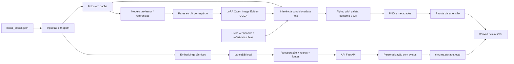

# Arquitetura do Aquário

## Decisões

**Produzir sprites fora da extensão; manter compatibilidade explicável em uma API local; renderizar assets estáticos no Chrome.** A extensão não carrega pesos de imagem nem executa inferência a cada frame.

| Camada | Implementação | Papel |
|---|---|---|
| Fonte | JSON original, preservado | Fichas e URLs das fotos |
| Ingestão | Python / `aquarium/catalog.py` | IDs SHA-256 da URL, classificação, triagem de campos suspeitos e promoções |
| Imagem | Pillow + NumPy; Qwen Image Edit 2509 / Diffusers ou DiffSynth em CUDA | Foto → edição estilizada → sprite RGBA |
| Trabalho em lote | SQLite, um worker sequencial | Estados, tentativas, erros, retomada e cache por conteúdo |
| Treino | DiffSynth-Studio + Accelerate, LoRA rank 16 | Aprender transformação condicionada à fotografia |
| RAG | SentenceTransformers multilíngue 384D + LanceDB persistente | Embeddings técnicos e recuperação citável |
| Decisão | Regras Python, sem LLM | Interseção global de faixas, água, comportamento, alimentação e tamanho |
| API | FastAPI + Uvicorn em 127.0.0.1:8765 | Catálogo, busca e avaliação |
| Chrome | Manifest V3, JavaScript, Canvas 2D e Shadow DOM | Aquário flutuante, popup e configuração |
| Persistência | `chrome.storage.local` | Espécies, pausa e localização aproximada |



## Adaptação do isometric.nyc

A [documentação do projeto](https://github.com/cannoneyed/isometric-nyc/blob/main/docs/data.md) descreve pares sintéticos de renderização/geração, Qwen Image Edit ajustado e uma tarefa de preenchimento com contexto visual prévio. Para organismos isolados, não há fronteira de terreno a costurar. A adaptação usa a foto como referência de identidade, imagens fixas como referências de estilo e normalização comum depois da geração.

O prompt fixa vista lateral dos animais, orientação à direita e luz superior esquerda. A paleta compartilhada, grid 96×96, margem e contorno externo de um pixel são impostos por código. **Perspectiva, identidade e iluminação são controles probabilísticos do modelo: o normalizador não prova que foram respeitados.** As três amostras foram inspecionadas visualmente. O lote precisa de avaliação de identidade e direção da luz antes de ser considerado final.

Três imagens de professor foram produzidas com o ImageGen integrado, usando as fotografias reais. Isso valida a abordagem e entrega sprites utilizáveis; não equivale a treinamento do Qwen. O script de smoke padrão reproduz o pós-processamento dessas edições salvas sem cobrar nova inferência. `--backend qwen` ou `--backend diffsynth` faz uma nova inferência no worker GPU.

## Estrutura

```text
aquarium/
  catalog.py        ingestão sem modificar a fonte
  sprites.py        cache, backends, normalização, QA e jobs
  rag.py            embedding, recuperação e regras
  api.py            endpoints locais
  cli.py            audit / index / sprites / export
config/
  style.json        contrato visual versionado
  smoke.json        três itens reais
scripts/
  smoke_sprites.py  teste inicial antes do lote
  prepare_pairs.py pares foto/target e split por espécie científica
  train_lora.py    launcher da receita oficial condicionada
  refresh.py       catálogo → geração incremental → índice → exportação
extension/
  manifest.json    permissões MV3
  background.js    consulta ao RAG pelo service worker
  content.js       painel arrastável, Shadow DOM, limpeza
  renderer.js      Canvas, sprites e movimento
  solar.js         posição solar calculada localmente
  popup.*          personalização e avisos
  assets/          sprites e catálogo público compacto
data/
  sources/         fotos originais do smoke e cache de futuras fotos
  references/      edições do professor e prompts efetivamente utilizados
  generated/       PNGs, metadados, relatório e SQLite de execução
  pairs/           inputs e targets, treino/validação e proveniência
  index/           LanceDB e configuração do embedding (regenerável)
  cache/           modelo de embeddings (regenerável)
  audit.json       campos ausentes/suspeitos
models/            adaptadores treinados (ainda não produzidos)
tests/             Python e testes solares Node
```

## Compatibilidade e qualidade da fonte

O conjunto contém 651 registros, não 651 espécies distintas. Há variantes comerciais, promoções e materiais de decoração. A triagem atual identifica 603 candidatos a assets; isso não certifica que todas as classificações estão corretas.

A busca semântica consulta os campos técnicos em português. Na avaliação, todas as espécies escolhidas são recuperadas por ID exato, junto das evidências semânticas filtradas por esses mesmos IDs. Assim uma espécie incomum não desaparece por causa do top-k. A busca não inventa faixas a partir de vizinhos semanticamente parecidos. LanceDB faz busca exata sobre os vetores, apropriada para 651 documentos; índice ANN só se torna necessário em escala maior.

A decisão tem três estados:

- `incompatible`: não há interseção global de pH/temperatura ou há conflito explícito de tipos de água.
- `uncertain`: campos ausentes/suspeitos, salinidade ambígua, territorialidade ou risco heurístico de predação/herbivoria.
- `compatible`: os critérios implementados estão completos e não há conflito detectado. Não é certificação de manejo real.

Temperaturas fora de 10–40 °C entram em revisão; estes são limites de triagem do scraper, não limites universais da vida aquática. Nunca se corrige uma temperatura para um valor adivinhado. A categoria `/agua-doce/` não prova salinidade: o próprio catálogo menciona espécies salobras. “Água doce ou salobra” resulta em incerteza, pois falta informação sobre salinidade efetiva/tolerância. Origem entra no embedding, não é usada como sinônimo de compatibilidade.

A primeira ficha tem pH e temperatura aparentemente trocados. Mantivemos os valores originais e invalidamos a temperatura suspeita na camada de fatos. GH/KH, volume, lotação, sexo e cardumes não estão suficientemente especificados e não são decididos por este motor. IDs são de produto, não de táxon; deduplicação de variantes no treinamento ocorre pelo nome científico.

## Extensão e fluxo de confirmação

O popup usa os PNGs empacotados. O usuário adiciona/remove espécies e consulta `/compatibility` antes de salvar. Conflitos bloqueiam a combinação. Incertezas exigem reconhecimento explícito de uso na simulação. Se a API estiver indisponível, a nova combinação não é salva como validada. A configuração anterior continua renderizável offline.

O aquário abre mediante ação do usuário na aba atual por `activeTab` + `scripting`. Não se pede acesso permanente a todos os sites; por isso ele não reaparece automaticamente depois de uma navegação. Páginas internas do Chrome e Chrome Web Store não aceitam injeção. Fechar destrói o loop e remove o listener; injetar novamente alterna a visibilidade. O painel é arrastável, mas a posição ainda não é persistida.

A geolocalização é solicitada no popup, só no clique de “Usar localização”, via permissão opcional. Coordenadas arredondadas a duas casas ficam no dispositivo e não são enviadas à API. A [aproximação solar da NOAA](https://gml.noaa.gov/grad/solcalc/solareqns.PDF) calcula elevação solar diretamente em UTC e lida com dia/noite polares. Sem permissão, a UI identifica o ciclo aproximado por horário local. A localização salva pode ser atualizada com novo clique; não há rastreamento contínuo. Movimento noturno é uma escolha estética genérica, não um modelo etológico de cada espécie.

## Operação e novos itens

Um worker Linux com CUDA executa geração e treino; uma GPU de 80 GB é um ponto de partida conservador para Qwen, não uma garantia de capacidade/performance. Dimensionar por medição de pico de VRAM na primeira execução. A plataforma pode ser uma VM própria ou GPU alugada; nenhuma conta ou recurso pago foi criado. O backend CPU local atende o RAG. Não há chave no Chrome.

Após inserir itens no JSON, `scripts/refresh.py --backend diffsynth --lora ...` reexecuta ingestão, geração com cache, indexação e exportação. O ID permanece estável por URL; alterações da ficha, imagem, prompt, estilo, adaptador e referências invalidam os produtos relevantes. Fotos com a mesma URL são consideradas imutáveis no cache: remover o PNG/sidecar em `data/sources/` força nova coleta quando o servidor substitui o conteúdo sem mudar a URL.

A execução padrão é um worker por diretório de saída. SQLite não implementa uma fila distribuída com leases. Para escala, manter o contrato de job e substituir coordenação por uma fila com lock, backoff e armazenamento de objetos. O pacote atual não instala scheduler. Agendar `refresh.py` no worker é uma opção operacional; não é necessário trabalho manual por espécie quando o modelo e o estilo já foram validados. Falhas técnicas são registradas individualmente e retornam código de saída não zero. Publicação/atualização da extensão continua sendo uma etapa de release.

## Critério de entrega e limites

Executado neste Mac: geração das três referências com IA, pós-processamento e QA dos sprites, índice real de 651 fichas, testes Python/Node e inspeção da prévia web. Implementado para execução em CUDA, mas não executado aqui: inferência Qwen, treino LoRA e lote completo. Ainda falta validar a extensão instalada em Chrome (service worker, permissões e injeção reais). Treinar só com três exemplos e afirmar generalização seria enganoso; o launcher bloqueia treinamento insuficiente.

### Valores pontuais

Muitas fichas extraídas apresentam `ph_min == ph_max` apesar de não haver evidência de uma faixa de tolerância de largura zero. A ingestão trata valores pontuais como incompletos, preservando o valor bruto, para evitar bloquear duas espécies só porque seus valores recomendados diferem. O mesmo vale para temperatura pontual. Sem recapturar/revisar a ficha, não é correto inventar limites em torno do número.
